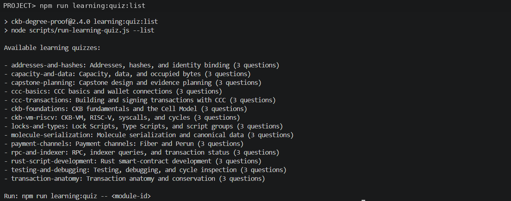
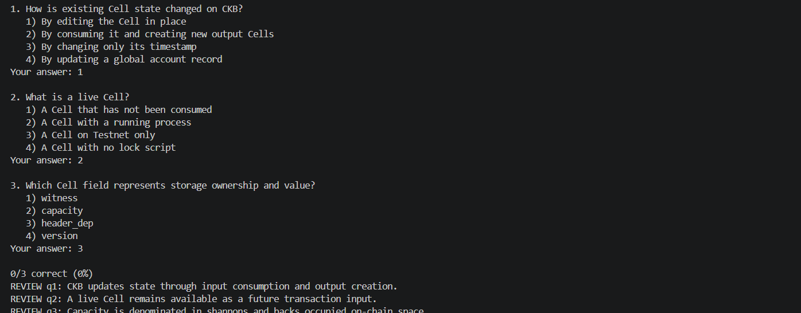
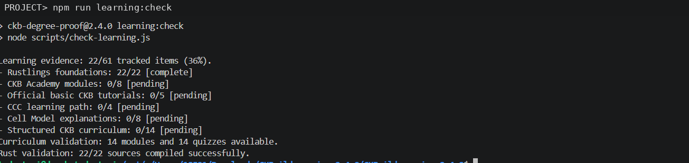

# CKBuilder Weekly Report — Week 3

**Reporting period:** 23–31 July 2026  
**Publication date:** 31 July 2026  
**Participant:** Dang Ba Ty  
**Project version:** CKB Degree Proof v2.4.0  
**Primary focus:** Structured CKB learning, evidence tracking, and community testing of FiberGuard  
**Time spent:** Not formally recorded; I will record hours directly during the next reporting period.

## Summary

During Week 3, I used the expanded CKBuilder learning system to review the CKB Cell Model, inspect the available curriculum, run a diagnostic quiz, and verify the repository's evidence-aware progress tracker. The repository exposed 14 structured learning modules with 42 quiz questions. The learning check reported 22 of 61 tracked items complete, corresponding to the 22 corrected Rustlings exercises; Academy, basic tutorials, CCC, Cell Model explanations, and the structured curriculum remain pending until I add valid completion records and screenshots.

I also supported another CKB builder by installing and testing **FiberGuard**, an IDE extension for diagnosing a local Fiber node. I confirmed that its health, peer, channel, invoice, and payment-history features could communicate with my local Fiber testnet node. During testing, I identified a compatibility defect in the Marketplace v0.0.1 release: the **View All Payments** request sent the `limit` value as decimal `50`, while Fiber `0.9.0-rc7` expected a hexadecimal value. Replacing `50` with `0x32` allowed the request to succeed. I reported the issue and recommended clearer empty-state guidance for nodes with no channels or payment history.

## Learning and practical activity record

| Activity | Result | Evidence |
|---|---:|---|
| Listed the structured learning quizzes | 14 modules / 42 questions available | [`../screenshots/week-03/01-learning-quiz-catalog.png`](../screenshots/week-03/01-learning-quiz-catalog.png) |
| Ran the `ckb-foundations` diagnostic quiz | 0/3 on the first recorded attempt | [`../screenshots/week-03/02-ckb-foundations-diagnostic-quiz.png`](../screenshots/week-03/02-ckb-foundations-diagnostic-quiz.png) |
| Reviewed the quiz explanations and corrected the three concepts | Completed as review; not claimed as formal module completion | [Corrected review](#diagnostic-quiz-review) |
| Ran the evidence-aware learning check | 22/61 tracked items, 36% | [`../screenshots/week-03/03-learning-progress-check.png`](../screenshots/week-03/03-learning-progress-check.png) |
| Rustlings foundation validation | 22/22 compiled successfully | [`../screenshots/week-03/03-learning-progress-check.png`](../screenshots/week-03/03-learning-progress-check.png) |
| Structured curriculum validation | 14 modules and 14 quizzes available | [`../screenshots/week-03/03-learning-progress-check.png`](../screenshots/week-03/03-learning-progress-check.png) |
| FiberGuard community testing | Core diagnostics worked; one request-format defect identified | [`../evidence/week-03-fiberguard-test-notes.md`](../evidence/week-03-fiberguard-test-notes.md) |

The diagnostic quiz attempt is recorded honestly as a learning baseline. It does not mark the module as complete. The repository remains evidence-aware and does not convert quiz availability, reading, or local practice into official handbook completion.

## Commands and observed output

### List the learning quizzes

```bash
npm run learning:quiz:list
```

Observed result:

- 14 quiz modules were listed.
- Every module contained 3 questions.
- The command displayed the required syntax for launching an individual quiz.

### Run the Cell Model foundations diagnostic

```bash
npm run learning:quiz -- ckb-foundations
```

Observed result:

```text
0/3 correct (0%)
```

The command then displayed review explanations for all three questions. I used those explanations to correct my understanding rather than recording a false pass.

### Validate learning evidence

```bash
npm run learning:check
```

Observed result:

```text
Learning evidence: 22/61 tracked items (36%).
Rustlings foundations: 22/22 [complete]
CKB Academy modules: 0/8 [pending]
Official basic CKB tutorials: 0/5 [pending]
CCC learning path: 0/4 [pending]
Cell Model explanations: 0/8 [pending]
Structured CKB curriculum: 0/14 [pending]
Curriculum validation: 14 modules and 14 quizzes available.
Rust validation: 22/22 sources compiled successfully.
```

## Diagnostic quiz review

The first quiz attempt exposed three basic Cell Model misconceptions. I corrected them as follows:

| Question | My recorded answer | Correct answer | Corrected understanding |
|---|---:|---:|---|
| How is existing Cell state changed on CKB? | 1 | 2 | A Cell is not edited in place. A transaction consumes an existing input Cell and creates one or more new output Cells. |
| What is a live Cell? | 2 | 1 | A live Cell is an unconsumed Cell that remains available as a future transaction input. |
| Which Cell field represents storage ownership and value? | 3 | 2 | `capacity` represents CKByte value and determines the on-chain storage capacity available to the Cell. |

This review was useful because the same consume-and-create model underlies the credential project's `ACTIVE → REVOKED` transition and Fiber payment-channel state changes.

## Community contribution — FiberGuard testing

### Project tested

**FiberGuard** is an IDE extension created by MorseCode to help Fiber developers inspect node health, understand failed payments, validate invoices, and review payment information in plain language.

Installation sources supplied by the developer:

- Visual Studio Marketplace: <https://marketplace.visualstudio.com/items?itemName=morse-code.fiberguard-vscode>
- Open VSX: <https://open-vsx.org/extension/morse-code/fiberguard-vscode>

### Test environment

| Item | Value |
|---|---|
| Editor | VS Code-compatible IDE |
| Extension release | Marketplace v0.0.1 |
| Fiber node | Local Fiber testnet node |
| Fiber version | `0.9.0-rc7` |
| Default JSON-RPC endpoint | `http://127.0.0.1:8227` |
| Node state during test | Running, but with no open payment channels |

### Features tested

| Feature | Result | Observation |
|---|---:|---|
| Extension installation and activity-bar entry | Passed | FiberGuard installed and opened successfully. |
| Health Details | Passed | The extension reached the local node and correctly reported degraded health because no channels were open. |
| Peer information | Passed | Peer-related information was returned through the node RPC. |
| Channel information | Passed | The extension correctly reflected that the node had no open channels. |
| Invoice parsing / “Can I Pay?” flow | Passed | Invoice information could be parsed and checked. |
| Payment history RPC | Passed after request correction | The RPC worked after the request limit was changed from decimal `50` to hexadecimal `0x32`. |
| View All Payments in Marketplace v0.0.1 | Defect found | The extension sent an incompatible decimal limit to Fiber `0.9.0-rc7`. |

### Defect identified

**Area:** `View All Payments`  
**Observed request value:** decimal `50`  
**Expected by Fiber `0.9.0-rc7`:** hexadecimal `0x32`  
**Result before correction:** the payment-history request failed  
**Result after correction:** the request completed successfully

This appears to be a request-serialization compatibility issue rather than a general node-connectivity failure, because the other FiberGuard diagnostics communicated with the same local node successfully.

### Feedback sent to the developer

> GM! I installed and tested FiberGuard successfully with a local Fiber testnet node.
>
> Health Details, peers, channels, invoice parsing, and payment history RPC all worked. The extension correctly detected that my node has no open payment channels and reported degraded health.
>
> One issue: the Marketplace v0.0.1 “View All Payments” request sends the limit as a decimal, while Fiber 0.9.0-rc7 expects a hexadecimal value. After changing 50 to 0x32, it worked correctly.
>
> Recommendation: patch the payment limit conversion and add clearer guidance when the node has no channels or payment history. Overall, the setup and diagnostics work well.

### Recommendations

1. Convert numeric pagination or limit fields to the hexadecimal representation expected by the targeted Fiber RPC version.
2. Add a regression test covering `View All Payments` against Fiber `0.9.0-rc7` request formatting.
3. Clearly distinguish a healthy but unused node from a failing node when there are zero open channels.
4. Show a friendly empty state when no payment history exists.
5. Display the connected Fiber version so developers can identify RPC compatibility issues more quickly.

No FiberGuard screenshot was supplied for this report. The contribution is documented through the written test record and exact defect reproduction. A future report should add a redacted screenshot of the extension's health page and the successful payment-history response if permission is available.

## Repository learning improvements used this week

The v2.4 learning workspace provided:

- 14 prerequisite-aware modules covering the Cell Model, transactions, CCC, Molecule, CKB-VM, Rust scripts, debugging, payment channels, and capstone planning;
- 42 validated quiz questions;
- a quiz-listing command and interactive terminal quiz runner;
- evidence templates for every module;
- an eight-week study plan, glossary, dev-log template, and capstone brief;
- an evidence-aware progress checker that avoids fabricating completion.

The most important reporting improvement is the separation between **available learning material**, **diagnostic attempts**, and **verified completion evidence**.

## Screenshots

### Structured quiz catalog



### First Cell Model diagnostic attempt



### Evidence-aware learning validation



The local username and Windows project path were removed from the first and third images before publication. No private keys, seed phrases, wallet secrets, API tokens, or `.env` values are visible.

## What I learned

- CKB state changes through transaction inputs and outputs rather than in-place mutation.
- A live Cell is an unconsumed output that can be referenced as a future input.
- Cell `capacity` represents both CKByte value and the right to occupy on-chain storage.
- A failed diagnostic quiz can be useful evidence when it is followed by a documented correction instead of being hidden or mislabeled as completion.
- Learning progress should be derived from explicit evidence files, not inferred from the presence of tutorials or source code.
- Fiber RPC clients must serialize parameters according to the node's expected hexadecimal conventions.
- A node with no channels may be operational while still being unsuitable for payments; diagnostics should communicate that state clearly.
- Testing another builder's tool can produce a concrete community contribution even when no code is committed to that project.

## Problems and corrections

### 1. Cell Model misconceptions

The diagnostic quiz returned `0/3`. Rather than rerunning the quiz until a pass appeared, I retained the result and reviewed each explanation. The corrected answers are documented in this report and will guide the next learning attempt.

### 2. FiberGuard payment-history parameter incompatibility

The extension's payment-history request failed against Fiber `0.9.0-rc7` because the limit was sent as decimal `50`. Using hexadecimal `0x32` corrected the request. I reported this precise compatibility issue to the developer.

### 3. Screenshot privacy

The original terminal screenshots included my local Linux username and Windows download path. Those prompt lines were replaced with a neutral `PROJECT>` prompt while leaving the commands and technical outputs unchanged.

## Evidence index

- [Week 3 machine-readable learning summary](../evidence/week-03-learning-summary.json)
- [FiberGuard test notes](../evidence/week-03-fiberguard-test-notes.md)
- [Quiz catalog screenshot](../screenshots/week-03/01-learning-quiz-catalog.png)
- [Foundations diagnostic screenshot](../screenshots/week-03/02-ckb-foundations-diagnostic-quiz.png)
- [Learning validation screenshot](../screenshots/week-03/03-learning-progress-check.png)
- [Screenshot security review](../screenshots/SECURITY_REVIEW.md)

## Next week

- Restudy the `ckb-foundations` lesson and rerun its quiz after explaining each answer in my own words.
- Complete one official beginner tutorial, beginning with **Transfer CKB**, and retain the transaction, balance, and command screenshots.
- Retest FiberGuard after the payment-limit conversion is patched, if an updated release becomes available.
- Record time spent each day so Week 4 contains an accurate hours total.
