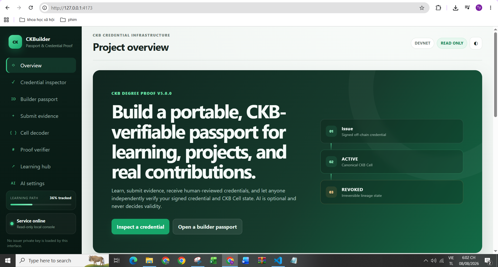
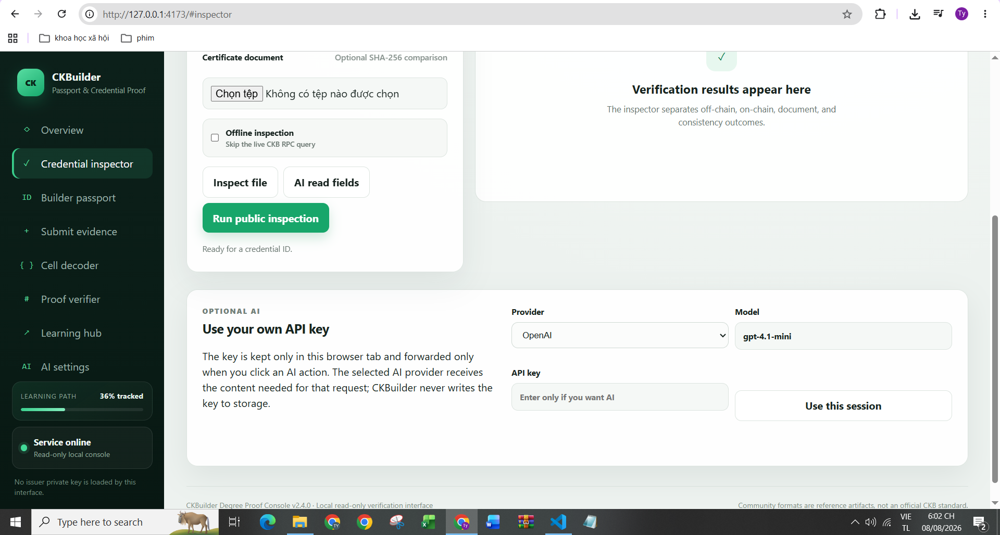
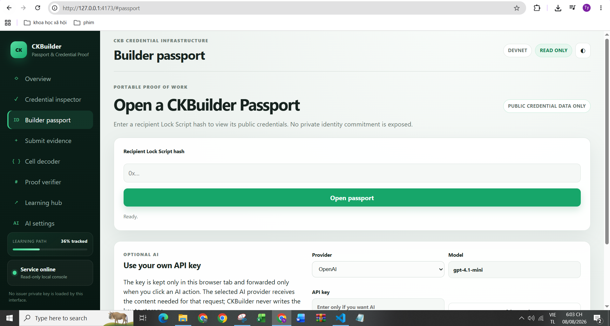
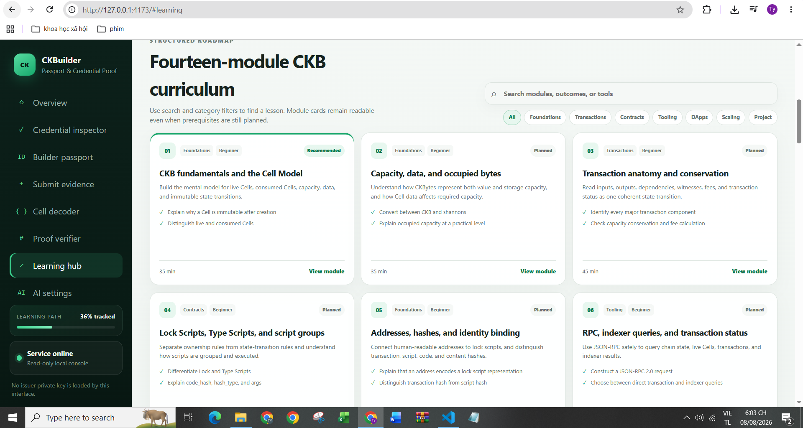
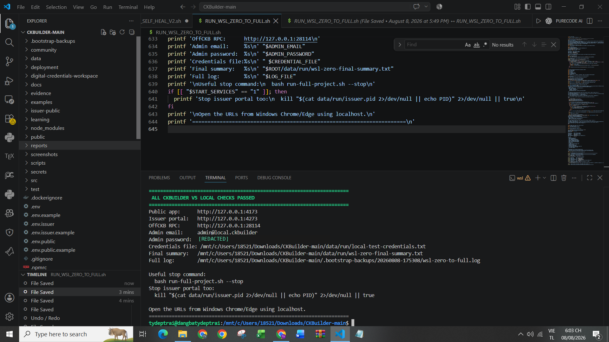

# CKBuilder Weekly Report — Week 4

**Reporting period:** 1–8 August 2026  
**Publication date:** 8 August 2026  
**Participant:** Dang Ba Ty  
**Project version:** CKBuilder Passport v5.0.0  
**Primary focus:** Production-oriented Passport workflow, optional BYOK AI, HTML/document evidence, full WSL validation, and community testing of Fiber Atlas  
**Time spent:** Not formally recorded; future reports should continue recording hours directly during the week.

## Summary

During Week 4, I focused on moving CKBuilder beyond a read-only credential proof demo and toward a complete application that can be exercised locally from issuance through verification. The public interface now presents a clearer CKBuilder Passport product with a project overview, credential inspector, builder passport, evidence submission, Cell decoder, proof verifier, fourteen-module learning hub, and optional AI settings.

The application preserves the deterministic trust boundary: cryptographic signatures, document hashes, trusted issuer configuration, CKB state, revocation state, and duplicate/conflict checks remain authoritative. AI is optional and uses a **bring-your-own-key (BYOK)** model. A user can provide an OpenAI, OpenRouter, Groq, or Gemini key for the current browser session, but AI does not receive issuer signing authority and cannot approve, issue, revoke, or override credential validity.

I also expanded document/evidence support so the application can work with HTML, text, Markdown, JSON, PDF, and common image formats. HTML is treated as hostile input and is sanitized before browser preview. Private evidence attachments are hash-checked and kept outside the public Passport view.

The most important operational milestone this week was completing a **zero-to-full WSL local validation**. The launcher prepared missing support files, initialized runtime configuration and issuer material, brought up the public app, issuer portal, and local OffCKB environment, and finished with `ALL CKBUILDER V5 LOCAL CHECKS PASSED`. The v5 release validation records **215 Node.js regression tests: 214 passed, 0 failed, and 1 skipped optional CCC integration test** because the dependency was unavailable in that validation environment.

In addition, I helped test **Fiber Atlas** locally using synthetic CKB transactions. Its core close/settlement/penalty classification worked. I identified two data-consistency issues: the `/faultline/unresolved` endpoint can include already-spent but unclassified cells, and duplicate unattributed events can be stored. I recommended filtering unresolved cells with `spend_tx_hash IS NULL` and using a stable non-null identifier such as `commitment_outpoint` for event deduplication.

## Main Week 4 results

| Area | Result | Evidence |
|---|---|---|
| Product overview | CKBuilder Passport v5 public interface running locally | [`../screenshots/week-04/01-v5-project-overview.png`](../screenshots/week-04/01-v5-project-overview.png) |
| Credential inspection | Public inspector available with document inspection and optional AI field reading | [`../screenshots/week-04/02-credential-inspector-ai-byok.png`](../screenshots/week-04/02-credential-inspector-ai-byok.png) |
| BYOK AI | User enters an API key only when AI is wanted; provider/model controls are exposed in the UI | [`../screenshots/week-04/02-credential-inspector-ai-byok.png`](../screenshots/week-04/02-credential-inspector-ai-byok.png) |
| Builder Passport | Public credential lookup by recipient Lock Script hash | [`../screenshots/week-04/03-builder-passport.png`](../screenshots/week-04/03-builder-passport.png) |
| Learning Hub | Fourteen-module CKB curriculum exposed through a searchable/filterable web UI | [`../screenshots/week-04/04-learning-hub-14-modules.png`](../screenshots/week-04/04-learning-hub-14-modules.png) |
| WSL zero-to-full run | Public app, issuer portal, OffCKB RPC, and local validation completed successfully | [`../screenshots/week-04/05-wsl-zero-to-full-pass-redacted.png`](../screenshots/week-04/05-wsl-zero-to-full-pass-redacted.png) |
| v5 regression validation | 215 total, 214 passed, 0 failed, 1 skipped optional integration | [`v5-final-test-summary.txt`](v5-final-test-summary.txt) |
| Fiber Atlas community testing | Core classification worked; two correctness/data-consistency issues identified | [`../evidence/week-04-fiber-atlas-test-notes.md`](../evidence/week-04-fiber-atlas-test-notes.md) |

## 1. CKBuilder Passport as a more complete application

The Week 4 interface makes the project easier to understand as a product rather than only a collection of CLI commands and proof files.

The public navigation now exposes these user-facing areas:

- **Overview** — explains the credential lifecycle and product purpose;
- **Credential inspector** — verifies signed/off-chain and on-chain credential state;
- **Builder passport** — opens the public credentials associated with a recipient Lock Script hash;
- **Submit evidence** — supports evidence-driven credential workflows;
- **Cell decoder** — retains a lower-level CKB debugging tool;
- **Proof verifier** — independently checks exported proof data;
- **Learning hub** — exposes the fourteen-module curriculum;
- **AI settings** — controls optional BYOK AI behavior.

The overview page now describes the intended lifecycle as:

```text
Issue
  ↓
ACTIVE
  ↓
REVOKED
```

where the on-chain transition remains irreversible for the current credential lineage.

### Screenshot — v5 overview



## 2. Credential inspector and optional BYOK AI

The credential inspector remains usable without AI. The deterministic verifier can inspect the credential ID, optional certificate document, cryptographic state, CKB state, and consistency outcome independently of any model provider.

AI is an optional assistive layer. The UI lets a user choose a provider/model and enter a key only if an AI action is wanted.

Current BYOK providers include:

- OpenAI;
- OpenRouter;
- Groq;
- Google Gemini.

The design intentionally separates AI from the authority path:

```text
AI
├─ read/extract evidence
├─ summarize
├─ explain
└─ recommend

Deterministic verifier
├─ SHA-256 document hash
├─ Ed25519 signature
├─ trusted issuer
├─ CKB Cell state
├─ revocation state
└─ duplicate/conflict detection

Human reviewer / issuer
└─ approve and execute authorized issuance/revocation
```

The user-supplied AI key is not intended to become part of credential data, the public Passport, audit exports, or CKB state.

### Screenshot — inspector and BYOK controls



## 3. Builder Passport

The Builder Passport gives a public view of credentials associated with a recipient Lock Script hash. The interface explicitly states that the page exposes **public credential data only** and does not reveal the private identity commitment.

This is an important product shift because the verifier is no longer limited to a single manually entered degree credential. The same application can represent learning, project, contribution, and other builder-oriented credentials.

### Screenshot — Builder Passport



## 4. Learning Hub in the web application

The fourteen-module curriculum is now visible through a structured web interface rather than only terminal commands. The page supports search and category filters such as Foundations, Transactions, Contracts, Tooling, DApps, Scaling, and Project.

The current module cards show learning outcomes and the planned/recommended state without falsely marking modules as completed merely because their content exists.

The visible modules include topics such as:

- CKB fundamentals and the Cell Model;
- capacity, data, and occupied bytes;
- transaction anatomy and conservation;
- Lock Scripts, Type Scripts, and script groups;
- addresses, hashes, and identity binding;
- RPC/indexer queries and transaction status.

### Screenshot — fourteen-module Learning Hub



## 5. HTML and document evidence support

Week 4 also extended the evidence/document layer beyond a single PDF path.

Supported evidence categories now include:

| Format | Main use |
|---|---|
| HTML / HTM | Safe visible-text extraction, sanitized preview, evidence analysis |
| TXT | Text evidence and AI-readable input |
| Markdown | Structured developer/project evidence |
| JSON | Machine-readable evidence |
| PDF | Deterministic byte hashing, attachment review/download |
| PNG/JPEG/WebP | Image evidence and optional vision analysis |

HTML is treated as untrusted input. Active markup such as scripts, frames, event handlers, forms, SVG/MathML, and related executable content is removed from the browser preview path. Raw evidence remains download-only rather than being directly injected into the application page.

Evidence attachments also retain a SHA-256 digest so later tampering can be detected.

## 6. Zero-to-full WSL validation

I ran the repository through the WSL bootstrap rather than stopping at static code inspection. The local run used WSL2 and exposed the application back to Windows through localhost.

The final terminal output reported:

```text
ALL CKBUILDER V5 LOCAL CHECKS PASSED

Public app:    http://127.0.0.1:4173
Issuer portal: http://127.0.0.1:4273
OffCKB RPC:    http://127.0.0.1:28114
```

The generated local admin password visible in the original terminal capture has been redacted from the report screenshot before publication.

The zero-to-full launcher is also designed to repair missing local support files before continuing. This was important because an earlier bootstrap attempt failed when `.env.example` was missing. The corrected workflow generates the required environment templates/runtime files when absent instead of assuming a perfectly packaged checkout.

### Screenshot — full local validation



## 7. Test and validation status

The repository's v5 validation summary records:

```text
JavaScript syntax check: PASS
Dedicated v5 HTML/document/storage/security suite: 32 passed, 0 failed
Full Node.js regression suite: 215 total, 214 passed, 0 failed, 1 skipped
Production configuration check: PASS
Attachment storage audit smoke test: PASS
Full private backup smoke test: PASS
```

The one skipped test is the optional `@ckb-ccc/core` integration test because that dependency was unavailable in the validation environment. It is recorded as skipped rather than incorrectly represented as passed.

The v5 regression coverage includes hostile HTML sanitization, MIME/extension mismatch handling, attachment authorization, reviewer-only preview/download, SHA-256 tamper detection, BYOK key non-persistence checks, sandboxed preview behavior, and a large-file base64 validation regression.

The later WSL run shown in this week's evidence additionally confirmed the local application stack could reach its final green `ALL CKBUILDER V5 LOCAL CHECKS PASSED` state.

## 8. Community contribution — Fiber Atlas testing

### Project tested

**Fiber Atlas** is a read-only Fiber observability project that analyzes CKB/Fiber channel-related activity such as close, settlement, penalty, and unresolved states.

### Test method

I tested Fiber Atlas locally using **synthetic CKB transactions** so that the classification pipeline could be exercised without depending on a live production event stream.

### What worked

The core close/settlement/penalty classification behaved correctly for the synthetic transaction cases I tested.

### Issue 1 — unresolved endpoint can include already-spent cells

I observed that:

```text
/faultline/unresolved
```

can include cells that are already spent but remain unclassified.

This can distort the meaning of “unresolved,” because a historical spent cell is different from a currently live unresolved cell.

**Recommendation:** filter unresolved state with:

```sql
spend_tx_hash IS NULL
```

so the endpoint represents currently unspent unresolved cells.

### Issue 2 — duplicate unattributed events can be stored

I also found that duplicate unattributed events can be stored when the deduplication identity is nullable or not stable enough.

**Recommendation:** use a stable non-null identifier such as:

```text
commitment_outpoint
```

and enforce idempotence or a database uniqueness constraint where possible.

### Feedback text

> GM! I tested Fiber Atlas locally with synthetic CKB transactions. The core close/settlement/penalty classification worked.
>
> I found two issues: `/faultline/unresolved` can include already-spent but unclassified cells, and duplicate unattributed events can be stored.
>
> Recommendation: use `spend_tx_hash IS NULL` for unresolved cells and a non-null identifier such as `commitment_outpoint` for event deduplication.

The full test note is stored at [`../evidence/week-04-fiber-atlas-test-notes.md`](../evidence/week-04-fiber-atlas-test-notes.md).

## What I learned

- Product readiness depends on the complete workflow, not only whether the core cryptography is correct.
- AI is safer and more useful when it explains or structures evidence while deterministic verification remains authoritative.
- A BYOK model lets AI remain optional and avoids requiring a project-wide model-provider credential for local use.
- Public and issuer/admin responsibilities should remain separated so the public interface does not load signing authority.
- HTML evidence must be handled as hostile content; a useful preview should not imply that arbitrary uploaded markup can execute.
- Test counts are only useful when skipped/optional integration cases are reported explicitly rather than hidden.
- A reproducible WSL launcher is valuable because environment and packaging defects can prevent a technically correct application from being tested by another developer.
- For observability tools such as Fiber Atlas, state semantics matter: an already-spent unclassified Cell should not automatically be treated as a currently unresolved Cell.
- Event ingestion needs stable non-null deduplication identities to avoid silently corrupting aggregate analytics.

## Problems and corrections

### 1. Missing bootstrap support files

An earlier zero-to-full run stopped because `.env.example` was absent. I changed the bootstrap approach so it can generate required local environment templates and runtime files when they are missing.

### 2. Local secret exposure in a screenshot

The successful WSL run prints a generated local admin password for convenience. That value was visible in the original screenshot, so I redacted it before including the image in this public report.

### 3. AI must not become a verification authority

Adding AI could easily blur the line between explanation and validation. I retained the design where AI only assists with extraction/analysis and deterministic cryptographic/CKB checks determine credential validity.

### 4. Fiber Atlas unresolved-state semantics

The local synthetic test showed that already-spent, unclassified cells can appear in `/faultline/unresolved`. I recommended basing unresolved state on `spend_tx_hash IS NULL`.

### 5. Fiber Atlas event deduplication

The test also exposed duplicate unattributed event storage. I recommended a stable non-null key such as `commitment_outpoint` for idempotent event ingestion.

## Evidence index

- [Week 4 machine-readable summary](../evidence/week-04-summary.json)
- [Fiber Atlas local test notes](../evidence/week-04-fiber-atlas-test-notes.md)
- [v5 release validation summary](v5-final-test-summary.txt)
- [Project overview screenshot](../screenshots/week-04/01-v5-project-overview.png)
- [Credential inspector + BYOK screenshot](../screenshots/week-04/02-credential-inspector-ai-byok.png)
- [Builder Passport screenshot](../screenshots/week-04/03-builder-passport.png)
- [Learning Hub screenshot](../screenshots/week-04/04-learning-hub-14-modules.png)
- [WSL zero-to-full PASS screenshot, password redacted](../screenshots/week-04/05-wsl-zero-to-full-pass-redacted.png)
- [Ready-to-send Week 4 message to Neon](week-04-message-to-neon.md)

## Next week

- Deploy the current public/issuer workflow against a real CKB Testnet configuration rather than only local OffCKB.
- Collect real Testnet transaction/outpoint evidence for at least one issued and revoked builder credential.
- Exercise the evidence submission/reviewer flow with another user rather than only the local developer account.
- Continue one curriculum module through an evidence-backed completion path instead of only exposing the module in the Learning Hub.
- Retest Fiber Atlas if the unresolved-cell filtering or event deduplication logic is updated.
- Record development/testing hours during the week so the next report includes an accurate time total.

## Message to Neon

A concise message ready to send is included separately in [`week-04-message-to-neon.md`](week-04-message-to-neon.md).
