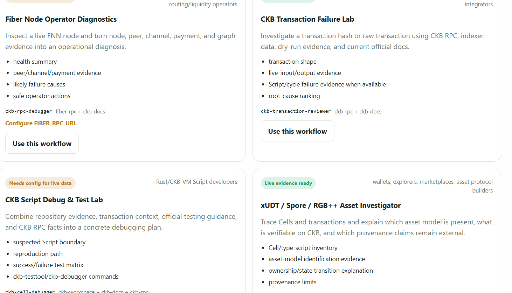
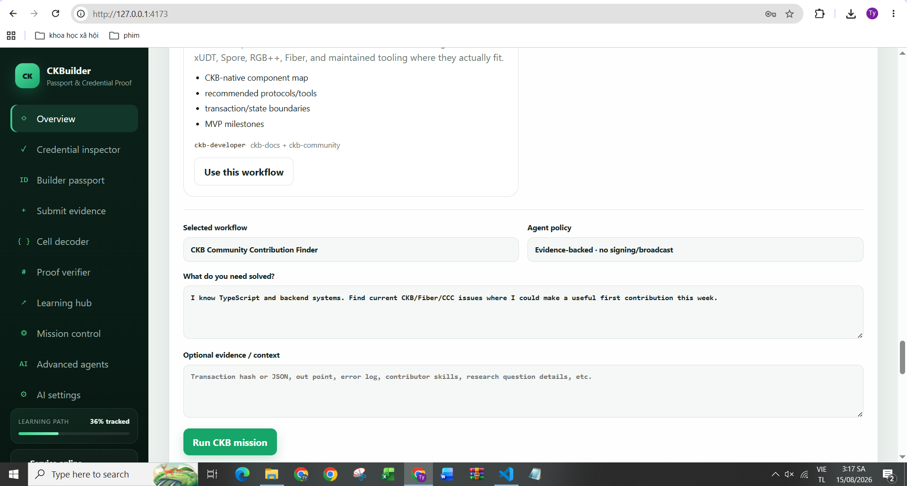
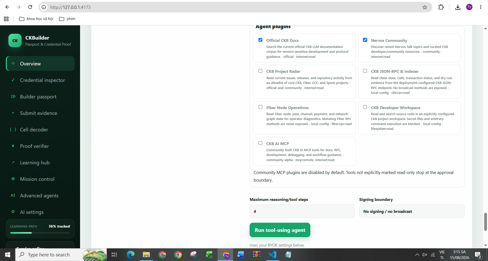
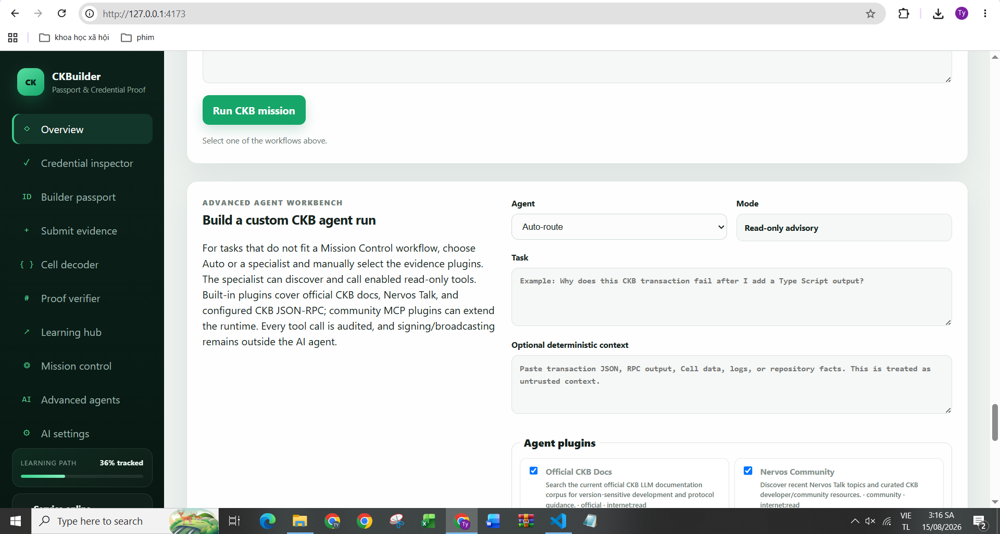
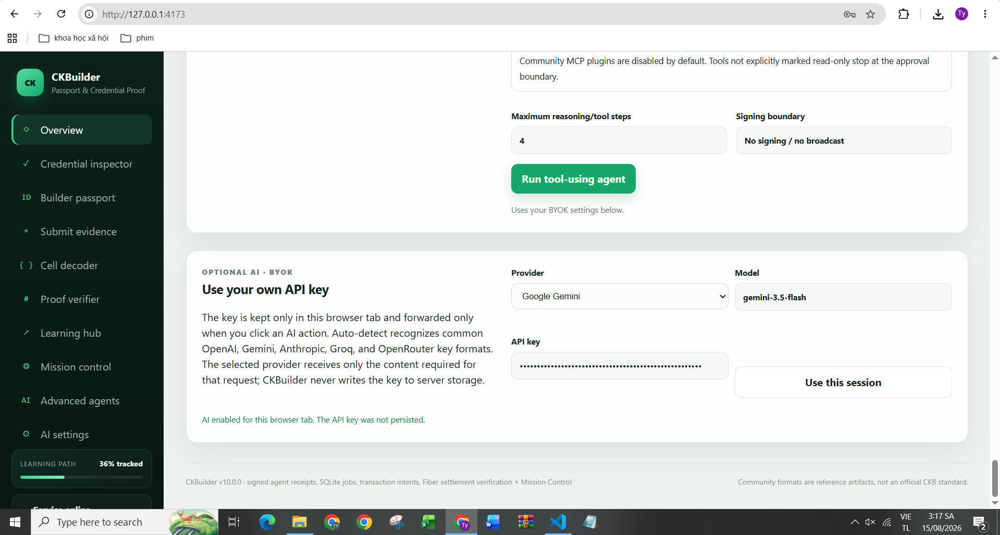
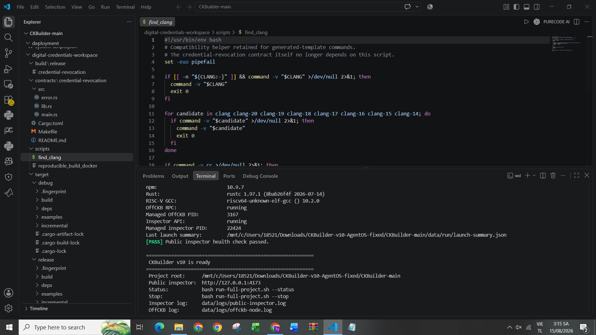
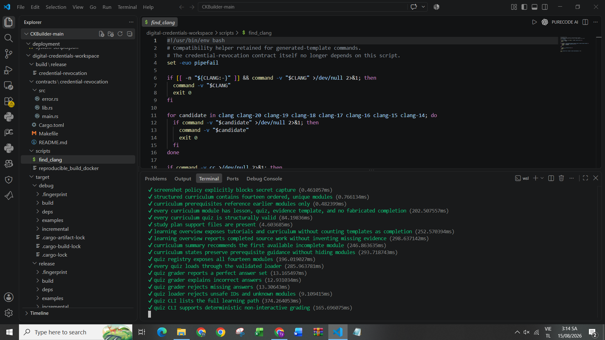

# CKBuilder Weekly Report — Week 5

**Reporting period:** 9–15 August 2026  
**Publication date:** 15 August 2026  
**Participant:** Dang Ba Ty  
**Project version:** CKBuilder AgentOS v10.0.1  
**Primary focus:** CKB-native agent operations, verifiable multi-agent services, transaction/Fiber safety workflows, MCP hardening, Gemini BYOK reliability, reproducible WSL execution, and Week 5 evidence capture  
**Time spent:** Not formally recorded; future reports should continue recording hours directly during the week.

## Summary

Week 5 moved CKBuilder from the earlier Passport-focused product into a broader **CKB AgentOS** while preserving the deterministic credential and chain-verification foundation. The main goal was not to give an AI model wallet authority. Instead, the system now lets agents research, inspect, plan, build unsigned intents, call bounded tools, coordinate specialist workflows, and produce verifiable receipts while leaving signing, broadcasting, real Fiber payment, and channel mutation outside the model boundary.

The most visible product change is **Mission Control**. Rather than presenting only a generic chat box, CKBuilder now exposes concrete CKB workflows for transaction forensics, Fiber node diagnostics, Script debugging, xUDT/Spore/RGB++ investigation, community contribution discovery, protocol research, and dApp architecture planning. An Advanced Agent Workbench remains available for tasks that do not fit a predefined workflow.

The agent runtime now supports a broader evidence/plugin layer: official CKB documentation and CKB Dev Skills, Nervos community material, read-only CKB RPC/Indexer operations, optional Fiber RPC diagnostics, a restricted CKB developer workspace, project/repository radar, and community MCP plugins. Remote MCP handling follows the 2026-07-28 protocol shape used by the project, including `server/discover`, while CKBuilder adds its own SSRF, redirect, response-size, tool-risk, and exact-argument approval protections.

Week 5 also strengthened verifiability. Agent jobs are persisted in SQLite, deployment service identity is Ed25519-based, completed receipts can be independently verified, and multi-agent team execution exposes an explicit workflow DAG rather than hiding coordination inside a sequential loop. Unsigned CKB transaction intents and Fiber settlement checks complete more of the real workflow without placing a private key inside AI execution.

A practical reliability issue was found during local use of the Google Gemini BYOK path: `POST /api/ai/application` could return `400 Bad Request` during tool-using Gemini workflows. The v10.0.1 patch updates the Gemini adapter to the current GenerateContent JSON field names, defaults new Gemini sessions to `gemini-3.7-flash`, stops forcing low custom sampling values for Gemini 3.x, preserves the model's raw function-call turn including `thoughtSignature`, returns matching `functionResponse` IDs/names, and exposes a sanitized upstream error detail if Google rejects a request again. The API now maps upstream provider rejection to a gateway error instead of mislabeling it as a local request-validation 400.

The final Week 5 validation result is recorded below and in [`v10.0.1-final-test-summary.txt`](v10.0.1-final-test-summary.txt).

## Main Week 5 results

| Area | Result | Evidence |
|---|---|---|
| Local stack | CKBuilder public inspector and managed OffCKB environment reach ready/running state | [`../screenshots/week-05/02-ckbuilder-ready-status.png`](../screenshots/week-05/02-ckbuilder-ready-status.png) |
| Regression execution | Full regression suite observed running in WSL/VS Code | [`../screenshots/week-05/01-regression-tests-running.png`](../screenshots/week-05/01-regression-tests-running.png) |
| Mission Control | Concrete CKB application workflows instead of a blank-prompt-first product | [`../screenshots/week-05/07-mission-control-applications.png`](../screenshots/week-05/07-mission-control-applications.png) |
| Community contribution workflow | Skill/context-driven contribution finder exposed in Mission Control | [`../screenshots/week-05/06-mission-control-contribution-finder.png`](../screenshots/week-05/06-mission-control-contribution-finder.png) |
| Agent plugins | Official docs, community, RPC, Fiber, workspace, project radar, and MCP surfaces visible | [`../screenshots/week-05/03-agent-plugins.png`](../screenshots/week-05/03-agent-plugins.png) |
| Advanced agents | Specialist routing, deterministic context, bounded tool steps, and signing boundary visible | [`../screenshots/week-05/04-advanced-agent-workbench.png`](../screenshots/week-05/04-advanced-agent-workbench.png) |
| BYOK AI | Browser-session Gemini configuration retained without server-side API-key persistence | [`../screenshots/week-05/05-gemini-byok-session.png`](../screenshots/week-05/05-gemini-byok-session.png) |
| Gemini reliability | Gemini 3 tool-loop request/response compatibility patched and regression-tested | `src/lib/ai-service.js`, `test/v6-agent-runtime.test.js`, `test/v7-http-ui.test.js` |
| Agent identity | Persistent Ed25519 service identity + signed `ckbuilder-agent-job-receipt/v2` | `src/lib/agent-service-identity.js` and v10 tests |
| Agent persistence | SQLite/WAL private agent-job ledger with legacy migration | `src/lib/agent-job-store.js` and v10 tests |
| Multi-agent execution | Parallel specialist nodes followed by explicit synthesis DAG | v10 agent-service runtime/tests |
| Transaction workflow | Unsigned CKB capacity-transfer intent + preflight + human wallet boundary | `/api/agent-commerce/transaction-build` and `/transaction-preflight` |
| Fiber workflow | Read-only quote/diagnostics and post-payment status verification; no autonomous payment | `/api/agent-commerce/fiber-quote` and `/fiber-payment-status` |
| Runtime/release CI | Runtime CI is separated from clean-release audit so live `.env`, secrets, state, and dependencies do not create a false release-audit failure | `package.json`, `check-env-and-run-all.sh` |
| Final automated suite | `**347 total; 346 passed; 0 failed; 1 optional CCC integration skipped**` | [`v10.0.1-final-test-summary.txt`](v10.0.1-final-test-summary.txt) |

## 1. CKBuilder AgentOS architecture

The Week 5 architecture is intentionally split into **model reasoning**, **deterministic evidence**, and **human-controlled authority**.

```text
User / CKB developer
        |
        v
Mission Control / Advanced Workbench
        |
        v
Planner / specialist routing
        |
        +-------------------------------+
        |               |               |
        v               v               v
 Official CKB docs   CKB RPC/Indexer   Community/MCP
 CKB Dev Skills      Fiber read-only   Workspace/Radar
        |               |               |
        +---------------+---------------+
                        |
                        v
               Evidence + audit trace
                        |
                        v
          unsigned intent / recommendation
                        |
                        v
                 HUMAN APPROVAL
                  /            \
                 v              v
            CKB wallet      Fiber wallet/node
                 \              /
                  +------v-------+
                         |
                         v
                result verification
                         |
                         v
               signed agent receipt
```

The important security property is unchanged: **AI does not hold signing keys and does not directly broadcast CKB transactions or send real Fiber payments.**

## 2. Mission Control: concrete CKB applications

Week 5 makes concrete applications the primary entry point for AI-assisted CKB work.

Current Mission Control workflows include:

1. **Fiber Node Operator Diagnostics** — read-only node, peer, channel, payment, and graph evidence when `FIBER_RPC_URL` is configured;
2. **CKB Transaction Failure Lab** — transaction/Cell structure, RPC evidence, dry-run evidence, and likely Script/cycle failure ranking;
3. **CKB Script Debug & Test Lab** — source/test inspection inside an explicitly configured safe workspace plus official testing guidance;
4. **xUDT / Spore / RGB++ Asset Investigator** — Cell/type-script inventory and evidence-backed asset-model/provenance analysis;
5. **CKB Community Contribution Finder** — current project/community evidence matched to contributor skills and a concrete first milestone;
6. **Protocol & Ecosystem Research Brief** — evidence-backed alternatives, unresolved questions, and research agenda;
7. **CKB dApp Architecture Advisor** — CKB-native component map, protocol/tool fit, transaction boundaries, and MVP milestones.

### Screenshot — Mission Control applications



### Screenshot — Community Contribution Finder



The UI explicitly marks workflows that need local configuration rather than pretending that live evidence exists. For example, Fiber diagnostics reports that `FIBER_RPC_URL` must be configured before it can produce live Fiber-node evidence.

## 3. Tool/plugin layer and MCP safety

The agent workbench exposes a plugin catalog rather than giving the model unrestricted operating-system or network access.

Visible Week 5 plugin surfaces include:

- **Official CKB Docs** — current official CKB LLM documentation and CKB Dev Skills grounding;
- **Nervos Community** — curated recent developer/community material;
- **CKB Project Radar** — allowlisted project/repository issue/release evidence;
- **CKB JSON-RPC & Indexer** — read-only chain, Cell, transaction, and dry-run evidence;
- **Fiber Node Operations** — read-only operator evidence when configured;
- **CKB Developer Workspace** — path-confined file discovery/search with secret and traversal blocks;
- **CKB AI MCP / community MCP** — data-only plugin manifests and explicit trust/approval boundaries.

### Screenshot — agent plugins



Remote MCP support is deliberately constrained. CKBuilder applies private-network/metadata-address rejection for untrusted remote endpoints, DNS resolution checks, redirect blocking, bounded response bodies, explicit plugin permissions, and a hard deny-list for signing/broadcast/payment/channel-mutation/secret-style operations.

Untrusted operations cannot be authorized by tool name alone in v10. Approval is bound to the canonical tool arguments:

```text
tool name + canonical arguments -> SHA-256 argumentsHash
```

so approval for one payload cannot silently authorize a different amount, target, or argument set.

## 4. Advanced Agent Workbench

Mission Control handles common workflows; the Advanced Agent Workbench remains available for custom CKB engineering questions.

It exposes:

- automatic or explicit specialist routing;
- deterministic context input for transaction JSON, RPC output, Cell data, logs, and repository facts;
- explicit plugin selection;
- bounded reasoning/tool steps;
- tool-call audit trail;
- read-only advisory mode;
- a visible **No signing / no broadcast** boundary.

### Screenshot — Advanced Agent Workbench



This is intentionally different from a general autonomous shell agent: the model can request a declared tool, but the host application decides whether that operation exists, whether it is safe, and whether additional approval is required.

## 5. Verifiable agent jobs and multi-agent workflow

The v10 service layer improves the earlier service-receipt concept in three ways.

### Persistent service identity

Each CKBuilder deployment owns a persistent Ed25519 service identity. The private key remains server-side in protected runtime storage. A completed `ckbuilder-agent-job-receipt/v2` includes the public identity/fingerprint and signature so another verifier can distinguish **content integrity** from **issuer authenticity**.

### SQLite agent jobs

The previous bounded JSON job ledger was replaced with SQLite/WAL-backed persistence. Job access remains protected by per-job access tokens, while aggregate reputation can be exposed without exposing private objectives/output content.

### Explicit workflow DAG

Multi-agent team services expose `ckbuilder-agent-workflow/v1` rather than a hidden sequential loop. Specialist nodes can run independently, and the synthesis node depends on all required specialist outputs. The workflow state/hash is included in the evidence/receipt path.

```text
              +--> specialist: ecosystem ----+
              |                              |
objective ----+--> specialist: security -----+--> synthesis --> signed receipt
              |                              |
              +--> specialist: operations ---+
```

This makes agent coordination inspectable and easier to test.

## 6. CKB transaction intent workflow

Week 5 adds more than transaction inspection. CKBuilder can build an **unsigned capacity-transfer intent** from supplied/discovered Cells.

The deterministic path covers:

- live Cell selection;
- target capacity;
- change calculation;
- fee accounting;
- transaction shape construction;
- static preflight;
- optional read-only `dry_run_transaction` evidence.

It intentionally does **not** make the model a wallet. Witness signing and transaction broadcast stay in an external/human-controlled wallet path.

```text
AI goal
  -> unsigned transaction intent
  -> preflight / dry-run
  -> human review
  -> external wallet signs
  -> external wallet broadcasts
  -> CKBuilder can verify resulting chain state
```

## 7. Fiber integration and agent commerce boundary

The Fiber integration follows the same authority model.

CKBuilder can:

- inspect configured Fiber node/operator evidence;
- create a payment feasibility/quote path with dry-run forced;
- record agreement/evidence in an agent job;
- verify a payment after external execution with read-only `get_payment`.

CKBuilder does not expose autonomous real payment or channel mutation to the agent runtime. This keeps commerce planning and evidence useful without making an AI API key equivalent to a payment key.

## 8. Google Gemini BYOK 400 fix

### Observed issue

During a browser-session Gemini Mission Control run, the frontend reported:

```text
POST http://127.0.0.1:4173/api/ai/application 400 (Bad Request)
Google Gemini returned HTTP 400.
```

The local HTTP endpoint was reachable; the error originated from the upstream Gemini provider path and was being flattened into a local 400 response.

### Root cause addressed in v10.0.1

The old provider-neutral tool loop did not fully preserve Gemini 3 function-calling state. It converted the model's function call into a generic tool call, then sent a generic user message containing the tool result. That discarded Gemini-specific model Parts such as `thoughtSignature` and did not guarantee an ID/name-matched `functionResponse` on the next stateless call.

The adapter also used older/non-canonical JSON spellings in several direct GenerateContent fields and supplied a low custom `temperature` intended for other providers.

### Corrected Gemini behavior

v10.0.1 now:

- defaults new Gemini selections to **`gemini-3.7-flash`**;
- uses canonical direct GenerateContent fields such as `systemInstruction`, `functionDeclarations`, `parametersJsonSchema`, `inlineData`, and `mimeType`;
- does not force CKBuilder's low generic temperature onto Gemini 3.x requests;
- preserves the complete prior Gemini model `content.parts`, including opaque `thoughtSignature` values;
- replays that model turn unchanged in the next stateless request;
- sends `functionResponse` with matching function `id` and `name` where the provider supplied an ID;
- preserves response cardinality for parallel Gemini function calls while still enforcing CKBuilder's maximum executable-tool budget;
- maps upstream provider errors to HTTP **502** and includes only sanitized upstream detail;
- renders that sanitized detail in the browser without persisting the user API key.

### Regression coverage

Dedicated tests now verify:

- current Gemini REST JSON field names;
- absence of the old custom Gemini sampling override;
- preservation/replay of a mock `thoughtSignature`;
- matching function call/response IDs;
- correct tool result continuation;
- upstream Gemini failure mapped to gateway failure;
- API key redaction from provider error details.

No real user Gemini API key is stored in the repository or test fixtures.

### Screenshot — BYOK Gemini session



The screenshot captures an existing browser session using `gemini-3.5-flash`. That model remains a valid stable model, but the v10.0.1 default for a newly selected Gemini provider is `gemini-3.7-flash` so the project starts from Google's current stable Flash recommendation while still allowing the user to choose an explicit model.

## 9. Runtime CI versus clean-release audit

A separate local reliability issue was also corrected this week.

The one-command launcher starts a legitimate runtime environment that may contain:

```text
.env
secrets/
node_modules/
data/run/*.pid
```

The clean-release audit is supposed to reject those paths in a distributable source archive. Running that audit *after starting the live workspace* therefore produced a false failure even though application tests passed.

The project now separates the two meanings:

```bash
npm run ci:runtime
```

runs syntax, plugin, learning, exercise, regression, and community checks against a live development workspace.

```bash
npm run ci:local
```

runs the same runtime checks **plus** `scripts/audit-release.sh` and is reserved for a clean release tree/archive.

`check-env-and-run-all.sh` uses `ci:runtime`, so it can safely validate an already-running project without weakening the release audit.

## 10. Local WSL evidence

The provided Week 5 WSL evidence shows the managed project reaching a ready state with:

- OffCKB RPC running;
- project-managed OffCKB PID recorded;
- public inspector API running;
- project-managed inspector PID recorded;
- public inspector health check passing;
- project root and log locations printed for troubleshooting.

### Screenshot — CKBuilder ready



### Screenshot — regression execution



## 11. Test and validation status

Final validation is summarized in [`v10.0.1-final-test-summary.txt`](v10.0.1-final-test-summary.txt).

```text
npm run test:ai:     144 tests, 144 passed, 0 failed, 0 skipped
npm test:            347 tests, 346 passed, 0 failed, 1 skipped
npm run ci:runtime:  PASS
community vectors:   6 verified; 2/2 vector tests passed
release audit:       PASS
learning tests:      23/23 passed
basic exercises:     5/5 passed
```

The optional CCC integration is reported as skipped only when `@ckb-ccc/core` is not materialized in the validation environment; it is not counted as a pass.

In addition to the broad suite, the Gemini-specific path is covered by focused provider/tool-loop regression tests, and all supplied screenshot evidence is now stored under [`../screenshots/week-05/`](../screenshots/week-05/).

## 12. What I learned

- A useful blockchain agent should not equate “autonomy” with possession of wallet secrets; unsigned intents and explicit approval boundaries provide real utility with a smaller failure domain.
- Provider-neutral LLM abstractions need provider-specific state handling where the upstream protocol requires it. Gemini 3 thought signatures are a concrete example.
- Tool-calling correctness is more than matching function names: multi-turn state, call IDs, response cardinality, and provider-specific metadata can be protocol requirements.
- An AI receipt needs both a content hash and an issuer signature if another party is expected to verify who produced it.
- Multi-agent systems are easier to audit when workflow dependencies and node states are explicit rather than inferred from logs.
- Local CI and release auditing are different operations. Runtime state is expected in a live workspace but forbidden in a distributable archive.
- Live-evidence readiness should be explicit. A workflow that needs Fiber RPC or a developer workspace should say so rather than fabricate or silently fall back to pretend-live results.
- Screenshots are useful evidence of UI/operational state, but they should be paired with machine-readable tests and logs rather than treated as proof of external network behavior.

## 13. Known limitations / honest boundaries

The following are intentionally **not** claimed by this Week 5 report:

- no autonomous CKB transaction signing or broadcast by the AI runtime;
- no autonomous real Fiber payment/channel mutation;
- no claim that a screenshot proves mainnet/testnet behavior;
- no claim that Fiber live diagnostics are available unless `FIBER_RPC_URL` is configured;
- no claim that workspace-aware analysis is available unless `CKB_AGENT_WORKSPACE` is configured;
- no real Gemini API key is committed, logged, or included in this report;
- the automated Gemini regression uses mock provider responses to validate request shape/state replay; a user's live provider availability, quota, billing, model access, and key validity remain external conditions;
- handbook modules remain incomplete unless their required evidence exists.

## 14. Commands used for Week 5 validation

Normal environment check + full local run:

```bash
chmod +x check-env-and-run-all.sh
./check-env-and-run-all.sh
```

Fast subsequent start:

```bash
./check-env-and-run-all.sh --fast --skip-ci
```

Status:

```bash
./check-env-and-run-all.sh --status
```

Runtime-safe CI:

```bash
npm run ci:runtime
```

AI/Gemini regression subset:

```bash
npm run test:ai
```

v10-specific regression subset:

```bash
npm run test:v10
```

Clean release validation only:

```bash
npm run ci:local
```

## 15. External references checked for the Week 5 update

The implementation/docs update was cross-checked against current primary sources on 15 August 2026:

- [Google Gemini API model catalog](https://ai.google.dev/gemini-api/docs/models) — current stable Gemini Flash model names;
- [Gemini 3 developer guidance](https://ai.google.dev/gemini-api/docs/gemini-3) — Gemini 3 sampling and thought-signature behavior;
- [Gemini GenerateContent API reference](https://ai.google.dev/api/generate-content) — current REST request/tool/function fields;
- [MCP 2026-07-28 specification](https://modelcontextprotocol.io/specification/2026-07-28) — protocol version and discovery semantics;
- [CKB AI Resources](https://docs.nervos.org/docs/ai-agents/ai-resource) — official CKB Dev Skills/AI guidance and version-sensitive verification warning.

## 16. Next steps

For Week 6, the highest-value next work is:

1. exercise the corrected Gemini path with a real user-owned key after the user confirms provider quota/model access;
2. add wallet-side handoff UX for unsigned transaction intents while keeping keys out of the agent server;
3. configure a disposable local/test Fiber node and capture a genuine read-only settlement/diagnostic evidence pack;
4. expand signed-receipt verification into a portable service reputation/export format;
5. add more community MCP manifests only after their permissions, endpoint policy, and failure behavior are independently reviewed;
6. publish one focused CKBuilder/CKB community contribution with reproducible evidence and record the resulting feedback/change;
7. keep release artifacts reproducible by testing a freshly extracted archive, not only the development tree.

## Screenshot index

All Week 5 images are stored in [`../screenshots/week-05/`](../screenshots/week-05/):

1. [`01-regression-tests-running.png`](../screenshots/week-05/01-regression-tests-running.png)
2. [`02-ckbuilder-ready-status.png`](../screenshots/week-05/02-ckbuilder-ready-status.png)
3. [`03-agent-plugins.png`](../screenshots/week-05/03-agent-plugins.png)
4. [`04-advanced-agent-workbench.png`](../screenshots/week-05/04-advanced-agent-workbench.png)
5. [`05-gemini-byok-session.png`](../screenshots/week-05/05-gemini-byok-session.png)
6. [`06-mission-control-contribution-finder.png`](../screenshots/week-05/06-mission-control-contribution-finder.png)
7. [`07-mission-control-applications.png`](../screenshots/week-05/07-mission-control-applications.png)
