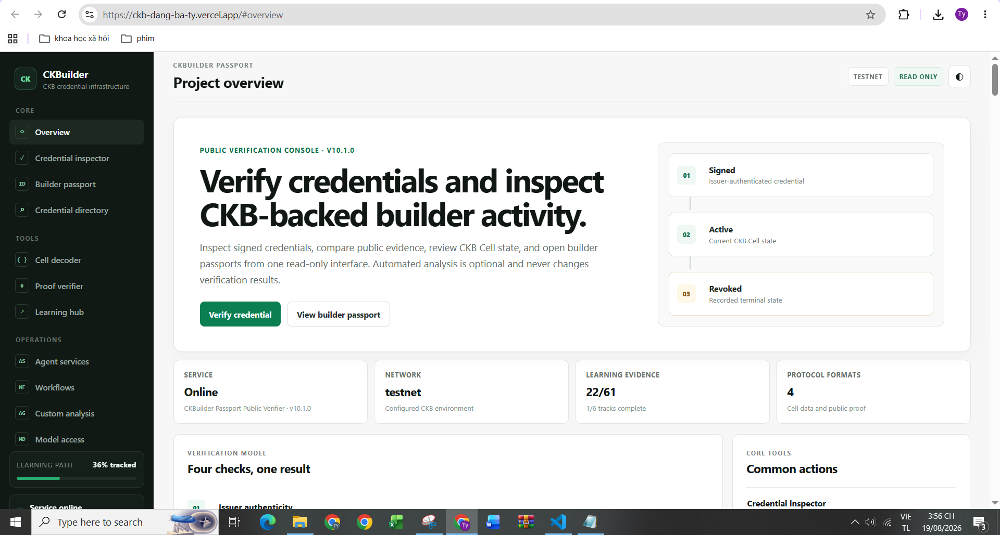
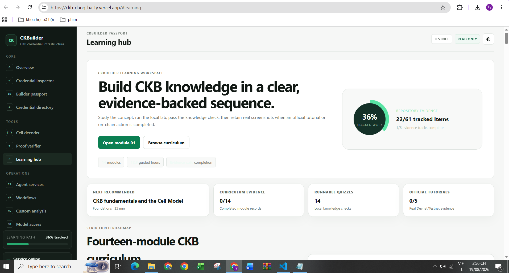
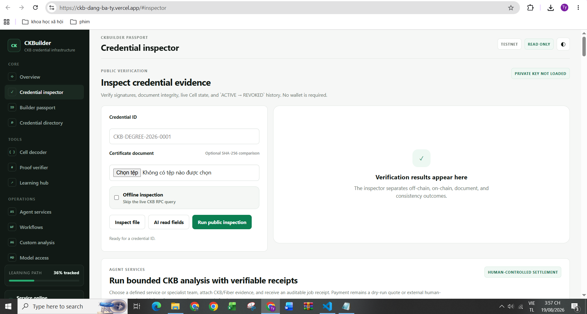

# CKBuilder Weekly Report — Week 6

**Reporting period:** 16–19 August 2026  
**Publication date:** 19 August 2026  
**Participant:** Dang Ba Ty  
**Project version:** CKBuilder AgentOS v10.2.0  
**Primary focus:** public deployment, 100% repository learning completion, and stronger checkpointed AI-agent workflows  
**Public deployment:** <https://ckb-dang-ba-ty.vercel.app/>

## 1. Week 6 summary

Week 6 closes three gaps that were still visible after Week 5.

First, CKBuilder moved from a locally demonstrated AgentOS to a publicly reachable Vercel deployment. The public application exposes the Overview, Credential Inspector, Builder Passport, Learning Hub, CKB tools, operational workflows, and optional BYOK agent functions while preserving the intended **Testnet / read-only / no-private-key** boundary.

Second, the repository learning tracker was completed from **22/61 (36%) to 61/61 (100%)**. All six tracked learning groups now have completion records and the result is reproduced by `npm run learning:check` rather than being a hard-coded UI percentage.

Third, the AI-agent layer was extended from tool-using and multi-agent execution into a more explicit workflow system. Agent services now have a **dependency-aware workflow plan, deterministic evidence-confidence evaluation, exact human approval gates, recovery actions, resumable checkpoints, checkpoint verification, and receipt bindings for the workflow plan/control/checkpoint**. A new **CKB Agent Workflow Orchestrator** coordinates planning, evidence verification, and risk/approval review as a specialist team.

The original public screenshots supplied for Week 6 were captured earlier on 19 August, before the final learning-evidence update, so the Learning Hub screenshot correctly shows the then-current **22/61 (36%)** state. The repository was subsequently completed to **61/61 (100%)** during the same Week 6 iteration. The screenshots are retained unchanged as historical deployment evidence rather than edited retrospectively.

## 2. Main Week 6 results

| Area | Week 5 / previous state | Week 6 result | Evidence |
|---|---|---|---|
| Public availability | Local/WSL-oriented validation | Public Vercel deployment available from a normal browser | [`../screenshots/week-06/01-public-vercel-overview.png`](../screenshots/week-06/01-public-vercel-overview.png) |
| Public security posture | AgentOS safety policy implemented in code | Public deployment visibly runs `TESTNET`, `READ ONLY`, and without issuer private key | [`../screenshots/week-06/03-public-vercel-credential-inspector.png`](../screenshots/week-06/03-public-vercel-credential-inspector.png) |
| Learning progress | **22/61 (36%)** | **61/61 (100%)**, all six tracks complete | [`../evidence/week-06-learning-check.txt`](../evidence/week-06-learning-check.txt) |
| Structured curriculum | **0/14** recorded | **14/14** completion records | `learning/curriculum/*/completion.md` |
| Basic tutorial topics | **0/5** recorded | **5/5** deterministic completion records | `learning/basic-exercises/*/completion.md` |
| Academy-aligned records | **0/8** | **8/8** | `learning/academy/module-01.md` … `module-08.md` |
| CCC learning | **0/4** | **4/4** | `learning/ccc-playground/` |
| Cell Model explanations | **0/8** | **8/8** plus transaction-lineage diagram | `learning/cell-model/answers.md` |
| Agent workflows | Multi-agent DAG + signed receipt | Plan → evidence scoring → approval gates → recovery → checkpoint → verification | [`../evidence/week-06-agent-workflow-check.txt`](../evidence/week-06-agent-workflow-check.txt) |
| Agent service catalog | Launch, incident, credential, wallet, asset, research services | Added **CKB Agent Workflow Orchestrator** specialist team | `src/lib/agent-commerce-service.js` |
| Deployment recovery | Vercel function initially crashed | Invalid `ISSUER_LOCK_HASH` isolated and corrected | [`../evidence/week-06-vercel-deployment-incident.md`](../evidence/week-06-vercel-deployment-incident.md) |
| Vercel preflight | Not yet publicly proven | Serverless adapter/read-only checks pass | [`../evidence/week-06-vercel-preflight.txt`](../evidence/week-06-vercel-preflight.txt) |

## 3. Progress comparison — Weeks 1 to 6

| Week | Main milestone | Progress introduced |
|---|---|---|
| **Week 1** | Credential application + Rust revocation Type Script | Established the signed credential model and irreversible `ACTIVE → REVOKED` CKB Cell transition. |
| **Week 2** | Public Credential Inspector + reproducible local workflow | Added independent read-only verification and a one-command local lifecycle. |
| **Week 3** | Evidence-aware learning system + community testing | Separated learning evidence from capstone features and established the 61-item tracker. |
| **Week 4** | CKBuilder Passport + Learning Hub + BYOK AI | Productized the credential prototype into a browser-based learning/verification workspace. |
| **Week 5** | CKBuilder AgentOS + Mission Control | Added specialist agents, MCP/tool use, signed receipts, transaction/Fiber safeguards, and multi-agent workflows. |
| **Week 6** | **Public deployment + 100% learning tracker + checkpointed agent orchestration** | Made the product publicly reviewable, completed all repository learning records, and strengthened AI workflows with deterministic control and recovery layers. |

The Week 6 milestone therefore completes both sides of the project: **learning progress** is now fully represented in the repository, while the **capstone engineering** has moved into a public, production-style deployment with stronger AgentOS execution controls.

## 4. Public Vercel deployment

The public application is available at:

<https://ckb-dang-ba-ty.vercel.app/>

### Figure 1 — Public Overview



The screenshot confirms that the application is reachable outside the local WSL development environment. The interface exposes service status, configured network, learning status, credential tools, Learning Hub, Agent services, workflows, and custom analysis from one product shell.

### Figure 2 — Public Learning Hub baseline



This screenshot was captured before the final Week 6 learning completion update and therefore shows **22/61 (36%)**. That value is retained as a historical baseline. After the remaining evidence records were added, the repository check reports **61/61 (100%)**.

### Figure 3 — Public Credential Inspector



The Inspector visibly reports the intended deployment boundary:

```text
TESTNET
READ ONLY
PRIVATE KEY NOT LOADED
```

The public runtime can verify and explain public evidence but cannot issue credentials, sign transactions, broadcast CKB transactions, or autonomously spend through Fiber.

## 5. Learning completion — 61/61 (100%)

The Week 6 learning update fills every tracked repository category:

```text
Learning evidence: 61/61 tracked items (100%).
- Rustlings foundations: 22/22 [complete]
- CKB Academy modules: 8/8 [complete]
- Official basic CKB tutorials: 5/5 [complete]
- CCC learning path: 4/4 [complete]
- Cell Model explanations: 8/8 [complete]
- Structured CKB curriculum: 14/14 [complete]
```

Validation command:

```bash
npm run learning:check
```

The structured curriculum also retains **14 runnable three-question quizzes**, and `npm run learning:test` validates the catalog, completion files, prerequisites, quiz schemas, quiz grading, and 100% progress calculation.

### Evidence integrity

The 100% value is the **CKBuilder repository learning-progress state**. Completion records explicitly avoid inventing Testnet transaction hashes, wallet signatures, or external certificates. Where no live-chain proof is present, the record identifies the completion basis as the deterministic CKBuilder practice model. This keeps the dashboard complete without converting missing external evidence into fabricated blockchain claims.

## 6. AI Agent workflow expansion in v10.2.0

Week 5 already provided specialist agents, tool use, MCP permissions, service agreements, receipts, transaction preflight, and multi-agent execution. Week 6 adds a workflow-control layer around those capabilities.

### 6.1 Dependency-aware workflow plans

Before execution, an Agent Service can now produce a `ckbuilder-agent-workflow-plan/v1` object containing:

- ordered workflow stages;
- explicit stage dependencies;
- evidence-source requirements;
- maximum agent-step budget;
- read-only-first execution policy;
- signing/broadcast/spending prohibitions;
- exact-argument approval requirements for non-read-only plugin tools;
- deterministic failure/recovery rules.

For a normal single service, stages are sequential. Team services continue to use parallel specialist execution where safe, followed by synthesis.

### 6.2 Deterministic evidence-confidence evaluation

After execution, CKBuilder calculates a workflow evaluation from facts that do not depend on model self-reporting:

- whether a final output exists;
- number of successful tool calls;
- evidence sources actually observed;
- required evidence sources;
- failed tools;
- pending approvals;
- service fulfillment verdict.

The result includes a bounded confidence score, state, blockers, matched evidence sources, and recovery actions. This makes an agent result easier to audit than a text answer alone.

### 6.3 Human approval gates

The workflow plan has explicit gates for:

1. **non-read-only plugin tools** — approval is bound to the exact tool and argument hash;
2. **wallet signing** — always outside the AI runtime;
3. **real fund movement** — CKB/Fiber execution remains controlled by the user or external wallet/client.

These gates preserve the Week 5 security design while making the boundary visible at the workflow level.

### 6.4 Resumable workflow checkpoints

Every Agent Service result now produces a `ckbuilder-agent-workflow-checkpoint/v1` record containing:

- workflow plan hash;
- workflow evaluation hash;
- completed stage identifiers;
- pending approval reference when applicable;
- tool-trace hash;
- output hash;
- deterministic next/recovery actions;
- checkpoint hash.

A new API endpoint independently verifies the checkpoint hash:

```text
POST /api/agent-commerce/verify-checkpoint
```

This is useful for Vercel/read-only deployments because the checkpoint is portable and does not require persistent server state to prove that the workflow state was not modified.

### 6.5 Receipt binding

`ckbuilder-agent-job-receipt/v2` now additionally binds:

```text
workflowPlanHash
workflowControlHash
workflowCheckpointHash
```

The existing signed receipt therefore covers not only the model output and tool evidence but also the deterministic workflow-control state.

### 6.6 New CKB Agent Workflow Orchestrator

A new team service was added:

**CKB Agent Workflow Orchestrator**

Specialists:

- **Workflow Planner** — decomposes the objective into CKB-specific stages and dependencies;
- **Evidence Verifier** — collects read-only CKB/Fiber/documentation evidence when configured;
- **Risk & Approval Gatekeeper** — checks secret, signing, spending, trust, write-tool, and rollback boundaries;
- **Synthesis** — combines the reports into one auditable workflow result.

Expected output:

```text
Workflow DAG
+ evidence coverage score
+ approval gates
+ recovery actions
+ resumable checkpoint
+ signed receipt
```

## 7. Deployment incident and recovery

The first Vercel deployment returned:

```text
500 INTERNAL_SERVER_ERROR
FUNCTION_INVOCATION_FAILED
```

The server log identified the actual cause:

```text
ISSUER_LOCK_HASH must be 0x followed by exactly 64 hexadecimal characters.
ENV_LOCK_HASH_INVALID
```

The invalid placeholder environment value was removed/replaced and the project was redeployed. This incident confirmed that environment validation runs before the serverless handler accepts normal traffic and prevents malformed CKB deployment identity data from silently entering the runtime.

## 8. Validation

The principal Week 6 checks are:

```bash
npm run learning:check
npm run learning:test
npm run test:v10.2
npm run test:v10
npm run vercel:check
npm test
```

Validation result for the completed Week 6 package:

```text
Full Node.js regression: 368 tests
Passed:                  367
Failed:                  0
Skipped:                 1 optional integration
Release audit:           PASS
Vercel preflight:        PASS
Learning tracker:        61/61 (100%)
```

The v10.2 workflow tests validate:

- dependency-aware plan generation;
- human approval gates;
- deterministic evidence scoring;
- checkpoint creation and tamper detection;
- the new Workflow Orchestrator catalog entry;
- receipt binding of plan, evaluation, and checkpoint hashes.

The release validation also restores and checks the sanitized environment examples, Git/Docker ignore rules, and executable launcher permissions that were missing from the earlier ZIP packaging.

See:

- [`../evidence/week-06-learning-check.txt`](../evidence/week-06-learning-check.txt)
- [`../evidence/week-06-agent-workflow-check.txt`](../evidence/week-06-agent-workflow-check.txt)
- [`v10.2-final-test-summary.txt`](v10.2-final-test-summary.txt)

## 9. Current capability boundary

### Public Vercel runtime

```text
Allowed
  -> credential/public-proof inspection
  -> Learning Hub and 61/61 progress display
  -> Cell/proof decoding
  -> BYOK AI analysis
  -> CKB/Fiber read-only evidence tools when configured
  -> unsigned transaction intents and deterministic preflight
  -> Agent Service workflow planning/evaluation/checkpointing
  -> signed/portable agent receipts

Not delegated to AI/serverless runtime
  -> issuer private key
  -> wallet seed/private keys
  -> transaction signing
  -> autonomous broadcast
  -> autonomous Fiber payment/channel mutation
```

The Vercel deployment remains appropriate for the public verifier and AgentOS analysis layer. Persistent issuer/admin operations should remain private or use an explicitly designed persistent backend.

## 10. Week 6 outcome

At the end of Week 6, CKBuilder has reached the following state:

- **public application deployed and reachable**;
- **61/61 repository learning items complete (100%)**;
- **14/14 structured modules complete**;
- **14/14 quizzes available and validated**;
- **5/5 beginner tutorial-topic completion records**;
- **8/8 Academy-aligned learning records**;
- **4/4 CCC learning records**;
- **8/8 Cell Model explanations**;
- **checkpointed, evidence-scored CKB agent workflows**;
- **multi-agent Workflow Orchestrator**;
- **exact human approval gates remain enforced**;
- **public runtime still holds no issuer private key and has no autonomous signing/spending authority**.

This completes the main Week 6 progression target: the project is no longer only a locally demonstrated AgentOS with partial learning evidence. It is a publicly reviewable CKBuilder product with a complete repository learning path and a more auditable AI-agent workflow layer.

## 11. Next milestone

Week 7 should focus on replacing repository-only evidence with stronger live ecosystem evidence where useful, without changing the completed learning percentage:

1. deploy the credential-revocation Type Script to CKB Testnet and retain real deployment metadata;
2. connect the public verifier to that real Testnet deployment;
3. retain one end-to-end public credential inspection with RPC/transaction evidence;
4. exercise the Workflow Orchestrator against a real CKB Testnet/RPC problem;
5. test checkpoint/resume behavior across separate browser/serverless requests;
6. add external persistent job storage only if a production use case requires it, while preserving the current public/private security boundary.
